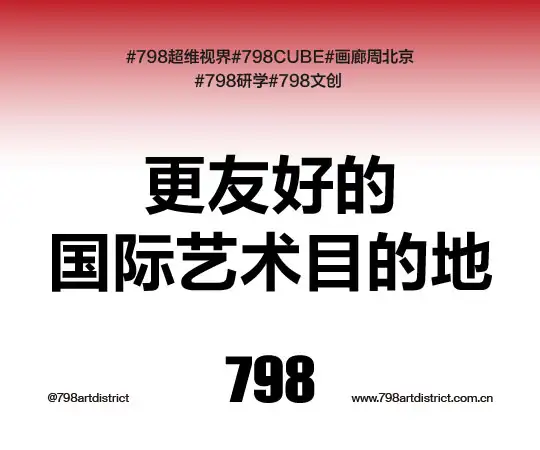

# (99+ 封私信 / 82 条消息) 国家市场监管总局转载媒体评论「外卖大战该结束了」，美团、阿里、京东股价大涨，释放了什么信号？

> 原文链接: https://www.zhihu.com/question/2020429578649236653

---
[

投资

](//www.zhihu.com/topic/19551404)

[

商业

](//www.zhihu.com/topic/19555457)

[

理财

](//www.zhihu.com/topic/19555939)

[

基金

](//www.zhihu.com/topic/19563921)

[

炒股

](//www.zhihu.com/topic/19587126)

# 国家市场监管总局转载媒体评论「外卖大战该结束了」，美团、阿里、京东股价大涨，释放了什么信号？

[每日经济新闻](//www.zhihu.com/org/mei-ri-jing-ji-xin-wen)

[​](https://www.zhihu.com/question/48510028)

已认证机构号

3月25日，国家市场监督管理总局官网转载《经济日报》评论文章《外卖大战该结束了》，引发市场强烈关注。 文章直指，这场持续一年的外卖平台补贴混战，影响的…显示全部 ​

关注者

**746**

被浏览

**1,251,545**

关注问题​写回答

​邀请回答

​好问题 23

​49 条评论

​分享

​

#### 369 个回答

默认排序

[彪彪彪](//www.zhihu.com/people/biao-biao-biao-96-30)

前端工程师一枚

​ 关注

706 人赞同了该回答

我是真的建议国家强制把外卖价格分成明确给消费者展示出来，促进外卖行业良性竞争。
也就是消费者下单时候能看到订单分成，也就是骑手拿了多少钱，平台抽成多少，商家最终拿到多少。然后是用的红包实际是平台补贴，还是商户补贴，这样下来涨价降价也是能接受了，好歹知道钱花哪里了，贵有贵的道理，便宜有便宜的原因。
有些东西还是挑明了好，让用户知道实际的饭钱是多少，优惠怎么来的，这优惠又是商家亏本补贴还是平台补贴的，还有这个免配送费本身就是不合理的，现在实际上都是商家出钱了。
我觉得就是得通过成本公式出来，这样能促进良性循环，用户一眼知道花多少钱买多少钱东西，也能相互比较各个平台你们抽成那么多，有提供多少的服务，也能之多骑手配送费花了多少。

再放几个抽成的图片吧，实际就是用户花的钱只有很少一部分是花在食物上。

这位网友说的很对，信息不透明容易矛盾转移，这样一来好多问题就有答案了，我花了多少钱，多少钱花在了吃的上，这个吃的划不划算就有合理的评价方法了。再有就是如果责任也好划分，比如餐撒了就扣骑手的配送费，商家东西准备错了那就扣餐费，骑手还要正常拿配送费

[编辑于 2026-03-27 14:10](//www.zhihu.com/question/2020429578649236653/answer/2020817370059474579)

​赞同 705​​74 条评论​18 ​12

​分享

​

​

收起​

[马超](//www.zhihu.com/people/ma-chao-28-99)

[​](https://www.zhihu.com/question/48509984)​[​](https://www.zhihu.com/kvip/purchase)

知势榜经济与管理领域影响力榜答主

[

收录于 · 投资启示录

](https://www.zhihu.com/column/c_1547251026750902272)

429 人赞同了该回答

外卖是最容易看到的，也是你跟我日常接触的

不要小看这篇文章，执笔人是经济日报的佘颖写的，携程就领教过此人的威力

再看经济日报，这属于财经类级别最高的央媒，仅次于三大央媒，人民日报、新华社、央视。

这篇文章有三大特点

第一，直接道明出外卖大战该结束了

第二，被市监转发，表明态度

第三措辞极其严厉，直接点出与中央提振消费的工作背道而驰

说“外卖大战该结束了”，意思就是反内卷要动真格了

上面对于内卷，确实一拳又一拳

一切可以从[价格法](https://zhida.zhihu.com/search?content_id=774739955&content_type=Answer&match_order=1&q=%E4%BB%B7%E6%A0%BC%E6%B3%95&zhida_source=entity)说起

《中华人民共和国价格法》的诞生，是中国社会主义市场经济法治化进程中具有里程碑意义的事件。该法于1997年12月29日经第八届全国人大常委会第二十九次会议通过，自1998年5月1日起正式施行，为国家运用法律手段规范和调控价格行为奠定了基础。其首要立法目的，是规范价格行为，发挥价格合理配置资源的作用，稳定市场价格总水平，并保护消费者和经营者的合法权益。

它将价格形式分为三类：由经营者自主制定的市场调节价、由政府规定基准价及浮动幅度的政府指导价，以及由政府直接制定的政府定价。绝大多数商品和服务价格实行市场调节价，政府定价范围则被严格限定在与国计民生、资源稀缺、自然垄断等相关的极少数领域。这一框架极大地推动了我国价格市场化的进程。

但是，现在法律“老化”的挑战越来越多

成本不明的鸡蛋

虚构原价的促销

暗中加价的电费

让修订的必要性在近年来日益凸显

**于是，2025年7月**，国家发展改革委和市场监管总局联合发布了**《中华人民共和国价格法修正草案（征求意见稿）》**。这部施行已27年的市场经济“基本法”首次迎来系统性修订，其核心目标之一，正是为了从法治层面整治无序竞争，为构建全国统一大市场提供坚实的法律保障。

可以说，这是个很大的信号

整治内卷，不是一次性动作

2024年7月，[中财委](https://zhida.zhihu.com/search?content_id=774739955&content_type=Answer&match_order=1&q=%E4%B8%AD%E8%B4%A2%E5%A7%94&zhida_source=entity)第六次会议提出“治理企业低价无序竞争”， 同年7月，[zzj会议](https://zhida.zhihu.com/search?content_id=774739955&content_type=Answer&match_order=1&q=zzj%E4%BC%9A%E8%AE%AE&zhida_source=entity)指出，要强化行业自律，防止“内卷式”恶性竞争，2024年12月，中央经济工作会议正式提出综合整治[“内卷式”竞争](https://zhida.zhihu.com/search?content_id=774739955&content_type=Answer&match_order=1&q=%E2%80%9C%E5%86%85%E5%8D%B7%E5%BC%8F%E2%80%9D%E7%AB%9E%E4%BA%89&zhida_source=entity)，规范地方政府和企业行为。

2025年12月18日，求是网的文章中说了这么一段话

“经济学中“内卷”一词来源于美国人类学家[克利福德·格尔茨](https://zhida.zhihu.com/search?content_id=774739955&content_type=Answer&match_order=1&q=%E5%85%8B%E5%88%A9%E7%A6%8F%E5%BE%B7%C2%B7%E6%A0%BC%E5%B0%94%E8%8C%A8&zhida_source=entity)的著作[《农业的内卷化》](https://zhida.zhihu.com/search?content_id=774739955&content_type=Answer&match_order=1&q=%E3%80%8A%E5%86%9C%E4%B8%9A%E7%9A%84%E5%86%85%E5%8D%B7%E5%8C%96%E3%80%8B&zhida_source=entity)，作者通过实证研究发现，爪哇岛在荷兰殖民者主导下不断地进行农业的精密化生产，虽然填充了大量劳动力，但人均产出并没有增加，人民生活水平长期停滞。今天我们讲的“内卷式”竞争，指的是经营主体为了维持市场地位或争夺有限市场，不断投入大量精力和资源，却没有带来整体收益增长的恶性竞争现象。“内卷式”竞争给一国经济发展带来的是资源配置的扭曲与效率的损失。”

2025年1月17日《学习时报》刊发国家市场监督管理总局党组书记、局长罗文署名文章《营造公平公正市场环境筑牢推动经济持续回升向好基础》

2026年1月21日，市场监管总局发布了2025年综合整治"内卷式"竞争十大典型案例。

整治内卷背后，是国家对互联网平台企业的态度转向

上面经常讲的一句话就是

“平台经济要在引领发展、创造就业、国际竞争中大显身手”

注意，这里的“大显身手”前面有三处限定语：是在“引领发展、创造就业、国际竞争”这三个领域。

也就是说，平台企业如果有真本事，那就得把工夫放在引领先进科技、创造新增就业、代表国家走向国际舞台这些“正道”上，而不是什么赚钱就去干什么，商业盈利诉求不能是平台企业唯一的经营考量

这才是国家希望看到的

如果谁还在衣食住行、家长里短这些看似“传统产业”的领域上穷追猛打，谁就必将遭到“反内卷”的批评和训诫；相反，只有把精力转到那些代表新质生产力的未来产业、或者拿出个像样的大国重器站到国际舞台上一决雌雄时，谁才能收到鲜花和掌声。

最后还想说的一点是

现在主打一个预期管理，你可以说这篇文章狗屁不通，逻辑不对，不食人间烟火

但是既然能放出来，那就有放出来的目的

送礼物

还没有人送礼物，鼓励一下作者吧

[发布于 2026-03-26 09:42](//www.zhihu.com/question/2020429578649236653/answer/2020435392705380466)

​赞同 429​​109 条评论​103 ​14

​分享

​

​

收起​

[每日经济新闻](//www.zhihu.com/org/mei-ri-jing-ji-xin-wen)

[​](https://www.zhihu.com/question/48510028)

已认证机构号

5 人赞同了该回答

## “外卖大战该结束了”，强监管信号释放，美团、阿里、京东股价应声大涨

每经记者｜赵雯琪 每经编辑｜金冥羽 张益铭

3月25日，国家市场监督管理总局官网转载[《经济日报》](https://zhida.zhihu.com/search?content_id=774736353&content_type=Answer&match_order=1&q=%E3%80%8A%E7%BB%8F%E6%B5%8E%E6%97%A5%E6%8A%A5%E3%80%8B&zhida_source=entity)评论文章《外卖大战该结束了》，引发市场强烈关注。

文章直指，这场持续一年的外卖平台补贴混战，影响的不仅是餐饮业老板的账本，更是普通人的生计。当作为消费“压舱石”的餐饮业因价格战而失速，经济大盘感受到的寒意，最终会传导至每个微观个体。文章呼吁，健康的竞争应是技术创新、效率提升、服务优化的良性角逐，而非依靠资本堆砌的烧钱游戏、利用垄断地位控流量逼站队的零和博弈。

事实上，这已是短期内监管层针对“内卷式”竞争的第二次重要动作。就在3月23日，北京市市场监管局联合市商务局、市文旅局，依法约谈和行政指导携程、去哪儿网、高德、京东、淘宝闪购、美团、飞猪旅行、同程旅行、途家民宿、小猪民宿、抖音、快手等12家平台企业，集中通报开展平台“内卷式”竞争综合整治以来发现的第一批问题，并提出整改要求。

监管信号层层递进，对外卖乃至整个平台经济的竞争秩序整顿，正在进入实质性阶段。25日午后，港股科网股应声大涨，“外卖三巨头”涨幅居前，美团涨近14%，京东涨近5%，阿里巴巴涨4.63%。

### 强监管信号

### 外卖大战将迎来转机？

从2025年2月京东高调宣布进军外卖市场开始，一场围绕“百亿补贴”的混战便正式拉开序幕。美团、淘宝闪购、京东外卖等平台在餐饮外卖、[即时零售](https://zhida.zhihu.com/search?content_id=774736353&content_type=Answer&match_order=1&q=%E5%8D%B3%E6%97%B6%E9%9B%B6%E5%94%AE&zhida_source=entity)领域展开全面交锋，烧钱补贴、免佣招商、骑手争夺轮番上演。

短短一年，这场以“百亿补贴”为名的烧钱混战，让各大平台付出了远超预期的代价。

从各家财报披露的数据来看，平台自身的损失较为明显。

阿里最新披露的财报数据显示，截至2025年12月31日止九个月，中国电商集团的经调整EBITA（扣除利息、税项及摊销前的利润）为834.99亿元，同比下降46%。其中，截至2025年12月31日止三个月，中国电商集团的经调整EBITA为346亿元，同比下降43%，主要是由于对即时零售、用户体验以及科技的投入所致。

京东最新披露的财报显示，包括京东外卖在内的新业务（主要包括京东外卖、京东产发、京喜以及海外业务）在2025年经营亏损达466亿元。不过，对于在外卖业务上的投入，京东称其外卖市场份额超过15%，获得超过2.4亿用户下单。

今年2月，在美团发布的盈利预警公告中，美团预计2025年录得亏损约233亿元至243亿元，而在2024年，美团的净利润为358.08亿元。美团表示，2025年出现亏损的原因主要是核心本地商业分部从2024年约524.15亿元的经营溢利转为2025年约68亿元至70亿元的经营亏损。

值得一提的是，外卖价格战的压力，不仅对餐饮门店造成影响，相关压力已传导至产业链行业内。今年2月，市场调研机构立信咨询对全国31个省级行政区的超过2000个餐饮商家进行调查访谈，揭露了外卖大战对相应产业的影响。

调研结果显示，39%的商户开始更换原材料价格更低廉的供应商，30%强化与供应商的议价博弈，这意味着，不少商家受制于价格战，正在向上游的供应链寻求降价以解决成本问题。

在剩下的三成商户之中，有20%已经选择增加了低成本菜品占比。这种供给的“降本”，也会给上游产业链造成新的影响。这组数据显示，价格下行压力正从商户持续向食材供应链传导。

如今，《经济日报》刊发评论《外卖大战该结束了》，并被国家市场监管总局官网转载。3月25日，百联咨询创始人庄帅在接受《每日经济新闻》记者采访时表示，此举实际上传递了明确的监管信号，旨在叫停依靠资本堆砌的恶性“内卷式”竞争，引导行业从烧钱补贴转向技术创新与服务优化的良性发展轨道。

3月25日，知名经济学者、工信部信息通信经济专家委员会委员盘和林在接受《每日经济新闻》记者采访时指出，今年的政府工作报告强调，综合运用产能调控、标准引领、价格执法、质量监管等手段，深入整治“内卷式”竞争，营造良好市场生态。“[反内卷](https://zhida.zhihu.com/search?content_id=774736353&content_type=Answer&match_order=1&q=%E5%8F%8D%E5%86%85%E5%8D%B7&zhida_source=entity)”是2026年政府经济工作的重要内容，而从2025年中开始，政府已经着手在外卖领域“反内卷”，多次约谈相关平台。此次转发向市场传递了深入整治“内卷式”竞争的开启信号，意味着未来在“反内卷”上将会有更多政策出台。

### 竞争转向

### 专家：也需有效区分“合理市场竞争”与“[内卷式竞争](https://zhida.zhihu.com/search?content_id=774736353&content_type=Answer&match_order=1&q=%E5%86%85%E5%8D%B7%E5%BC%8F%E7%AB%9E%E4%BA%89&zhida_source=entity)”

随着监管信号的明确释放，外卖行业即将告别野蛮生长的补贴时代，迈入一个以“反内卷”为核心逻辑的新阶段。

官媒的定调意味着，依靠“烧钱”来改变市场格局的窗口期正在关闭，未来新进入者或挑战者将面临更高的政策与舆论门槛。然而，这并不意味着竞争将就此平息。

对此，盘和林提醒，巨头外卖补贴大战可能会暂停，但巨头在其他方向的竞争还会频繁出现，当务之急是有效区分“合理市场竞争”与“内卷式竞争”，需要有明确的定义。

随着补贴大战的“刹车”，各平台将不得不重新审视自身的盈利模型。过去一年为了抢占市场份额而牺牲利润的做法将难以为继，平台需要从“规模扩张”转向“价值挖掘”，通过提升佣金效率、优化广告系统、提供增值服务等方式，从存量市场中实现可持续的盈利。美团在盈利预警公告中明确表示，将进行必要投入以维持领导地位，但不会参与“价格战”。这一表态，或许预示着平台将逐步退出不计成本的补贴竞赛。

与此同时，服务体验正在成为新的竞争焦点。当价格不再是唯一的决定因素，配送时效、准确率、售后服务、骑手保障等“软实力”将成为平台构建差异化优势的关键。平台需要投入更多资源优化算法，提升骑手福利待遇以稳定运力，加强商户管理以保障食品安全。

网经社电子商务研究中心数字生活分析师陈礼腾此前在接受《每日经济新闻》记者采访时表示，相较于2025年全域烧钱、价格战为主的粗放竞争，2026年巨头策略将向精准投入、效率优先、结构优化、生态整合转型。用户争夺从价格转向品质、时效与服务确定性。整体来看，行业从“烧钱换规模”进入“以效率定胜负、以壁垒分高下”的新阶段，竞争更理性、更持久，也更考验综合运营能力。

庄帅则认为，继外卖大战后，美团、阿里和京东会在外卖行业借助自身优势加大差异化竞争，同时加大即时零售领域的竞争，将焦点转向供应链生态整合、履约效率优化、AI（人工智能）技术赋能以及向高客单价的非餐品类（如3C、美妆）扩张，从“拼砸钱”转向“拼服务、拼效率、拼生态”。

综合来看，外卖行业正站在一个关键的转折点上。监管层的密集出手与官媒的明确定调，为这场持续一年的烧钱混战按下了暂停键。但对于平台而言，真正的考验才刚刚开始，如何在“反内卷”的框架下找到新的增长路径，如何在效率与规模之间取得平衡，如何通过技术创新构建差异化壁垒，将是决定未来竞争格局的关键。

“短期看，三家外卖平台的市场份额基本稳固，美团和阿里将保持两强地位。长期看，各家如今的业务重点都在AI，所以，外卖补贴战会时不时变相出现，但不会如去年那般激烈。”盘和林表示。

｜每日经济新闻 nbdnews 原创文章｜

未经许可禁止转载、摘编、复制及镜像等使用

[发布于 2026-03-26 09:21](//www.zhihu.com/question/2020429578649236653/answer/2020430069659617231)

​赞同 5​​添加评论​2 ​喜欢

​分享

​

​

收起​

[

腾讯云推“小龙虾”，免部署直连多平台！

免部署安装，1分钟极速直连多平台！注册即享5000 Credits体验补贴，轻松实现远程办公与协作！查看详情

](https://www.codebuddy.cn/work?fromSource=gwzcw.11254341.11254341.11254341&utm_medium=cpc&utm_id=gwzcw.11254341.11254341.11254341&cb=https%3A%2F%2Fsugar.zhihu.com%2Fplutus_adreaper_callback%3Fsi%3D4c1a7ebc-33d0-41b8-9377-e5022629cb5a%26os%3D3%26zid%3D236%26zaid%3D3715106%26zcid%3D3689670%26cid%3D3689670%26event%3D__EVENTTYPE__%26value%3D__EVENTVALUE__%26ts%3D__TIMESTAMP__%26cts%3D__TS__%26mh%3D788d5930cdd2e73de38053152eaf0aef%26adv%3D771784%26ocg%3D8%26cp%3D1000%26ocs%3D0%26aic%3D0%26atp%3D0%26ct%3D2%26ed%3DGiBNJgVzfCMmUW9XFyEvRA8xBGxJICwkOhh0FlwxKw1fY0gnWzUoISkY6onvXKClOvM%3D&spu=biz%3D0%26ci%3D3689670%26si%3Da14fc37a-d721-41ae-bbbb-fcc76cf40c51%26ts%3D1774596100%26zid%3D236)

WorkBuddy的广告 · 21.4 万人浏览

[王子君](//www.zhihu.com/people/nogirlnotalk)

[​](https://www.zhihu.com/question/48509984)​[​](https://www.zhihu.com/kvip/purchase)

知势榜经济与管理领域影响力榜答主

191 人赞同了该回答

谢邀。

去年餐饮收入才增长3.2%，自22年放开以来增速最低。

你要是市监总局你也难绷：你们巨头打就打，别把我的经营主体和就业主体给磨死了。

* * *

去年外卖大战开始，我就说市监总局坐不住：

一，巨头层面，互殴很正常。

美团想从外卖业务进一步切入电商、京东想增加物流体系的复用率和估值、阿里又有外卖又有电商想趁机扎深。

这仨业务边界相互重合越来越深，打起来很正常。

二，但监管部门会麻了。

要明确，市监总局的服务对象不是行业巨头，是海量中小微腰部底部。巨头是被市监监管的。

市监总局的核心KPI之一，就是年度新增企业和个体户数量。

所以尽管市监总局在观感上一副后妈脸，但在文件上确实尽量照顾中小微。

那市监总局是见过好几轮补贴大战了，套路很清晰：

战中：平台商户被裹挟参与，捆绑支付大量补贴成本。虽然订单暴增，但增收不增利；

战后：订单退潮，之前被订单临时拱起的服务能力要出清，奶茶店关门外卖小哥没单。

企业中最脆弱的末端——服务业个体户，就业中最脆弱的末端——派遣工，这俩就是平台互殴的耗材。

但偏偏这俩耗材又是咱这真正的经营和就业主体，单餐饮业从业人数保守估算3000万，第一大就业单独门类。

所以虽然市监总局背着反垄断的任务，但实操里市监非常希望寡头们别打，就那么点利润率嘎嘣一下打没了。

* * *

但事情也没这么简单：我的拼好饭呢？

消费者处于一个有点尴尬的位置。

我知道补贴大战对商户不公平，但6块5的炒饭真的很超模。

从长期看，补贴大战后平台肯定会回价收割；但短期里消费者就是获利了。

现在市监出面定性，说轻了就是消费者少了羊毛可薅，说重了就是屁股坐到巨头那桌，鼓励大而不倒，鼓励寡头垄断，客观上帮助平台们拉高单价。

结合文章里和最近政策口对CPI的追求，“促进物价温和上涨”，你们果然一伙的。

我的收入没有温和上涨，你们个个想尽办法让价格上涨，X社会以和为贵是吧。

* * *

这就又回到了咱之前的那个观点：

咱依然是个制造国，依然效率导向产能优先。

因此在具体政策里，保护的末端基本就到中小微，他们是交易纳税就业的最后节点；

政策不会明确站台打工人，例如最低工价和加班。而且越是小微个体户里的打工人，力度越弱；劳动仲裁最有效的反而是针对大企业。

因为政策始终担心，如果从底层就启动可能折损劳动效率的保护，会不会导致全局的产出效率和就业吸纳降低。

你觉得每天工作10小时周休4天太鬼了，政策觉得干掉这些就业我上哪给你找班上。

所以在这么热闹的反内卷里，你独独看不到政策站在最最末端的打工人角度来一句：你们要保障最低价也能符合最低工时工资要求哈。

* * *

所以平台们股价大涨：不仅是利空告一段落，而且侧面说明政策承认现有市场格局。

那就各家罢兵，回家收割。

成本可预期下降、收益可预期提升，好看的财报就要来了，涨。

至于更深远的信号，那就是政策始终长期亲产业化。谁能搞来纳税就业资产增值，谁就是好孩子。

劳动保障的博弈会是件很漫长的事情。

* * *

闲聊公号：王子君的碎碎念。

送礼物

还没有人送礼物，鼓励一下作者吧

[发布于 2026-03-27 13:32](//www.zhihu.com/question/2020429578649236653/answer/2020855770909032673)

​赞同 189​​19 条评论​30 ​14

​分享

​

​

收起​

[阿斯加德传说](//www.zhihu.com/people/hei-shen-er-cheng)

拍照可以约我

1227 人赞同了该回答

如果结束的方式是为骑手涨工资，确保安全的情况下收入可观，缴纳[社保](https://zhida.zhihu.com/search?content_id=774879109&content_type=Answer&match_order=1&q=%E7%A4%BE%E4%BF%9D&zhida_source=entity)。平台抽成减少，把利润还给门店。我是支持的。

如果结束的方式是外卖涨价，平台拿大头，店铺白忙不赚钱，骑手继续被算法吊打。我是不支持的。

[发布于 2026-03-27 08:32](//www.zhihu.com/question/2020429578649236653/answer/2020780207640985881)

​赞同 1226​​87 条评论​21 ​31

​分享

​

​

收起​

[

广告

](https://sugar.zhihu.com/glory_adreaper/glory_log?coi=0&zr=0&pf=Mac+OS+X&src=brand&bi=3817&ar=0.0067&tue=AQENERpeSUEVDg1XXkxBABsQAgcRDQgQCgFXAgYJSA0MVrpH7JO0E1YH&lr=1&ed=CjEEKVQqOStoVjtaAWUvB18mCSgVIWJzLQhmVwMyYVFScQBnW3Vrd38cYlYEY34DTSRDdwtlOykqGGNVCWB_Bk01UHcJdWN5eAMxDgxheQZecQFsWTZndnwRYEFdJXEGXnENew17a2Y-TDZaHGGwl4pQWfSz-w%3D%3D&cty=unknow&st=brand_opt&ts=1774596104&ui=2409%3A8a55%3A2ec7%3A56c1%3A65f5%3A356d%3A5b3%3Aefba&ct=1&ut=19cb36b3b172400daa73c6371c15d782&cc=440300)

相关问题

[美团外卖一个季度赚 15.8 亿，实力对手入局会对美团产生哪些影响？](/question/540050040) 3 个回答

[外卖大战账本即将揭晓，高盛预测三季度阿里亏 360 亿，美团亏 200 亿，京东亏130亿，你怎么看？](/question/1971512793418130714) 110 个回答

大家都在搜

换一换

[伊朗局势399 万](/search?q=%E4%BC%8A%E6%9C%97%E5%B1%80%E5%8A%BF&search_source=Trending&utm_content=search_hot&utm_medium=organic&utm_source=zhihu&type=content)热

[日本东京发生持刀伤人事件致 2 死398 万](/search?q=%E6%97%A5%E6%9C%AC%E4%B8%9C%E4%BA%AC%E5%8F%91%E7%94%9F%E6%8C%81%E5%88%80%E4%BC%A4%E4%BA%BA%E4%BA%8B%E4%BB%B6%E8%87%B4+2+%E6%AD%BB&search_source=Trending&utm_content=search_hot&utm_medium=organic&utm_source=zhihu&type=content)新

[AI短剧《雪山救狐狸》爆火398 万](/search?q=AI%E7%9F%AD%E5%89%A7%E3%80%8A%E9%9B%AA%E5%B1%B1%E6%95%91%E7%8B%90%E7%8B%B8%E3%80%8B%E7%88%86%E7%81%AB&search_source=Trending&utm_content=search_hot&utm_medium=organic&utm_source=zhihu&type=content)新

[南京教师因发表过激言语被停职398 万](/search?q=%E5%8D%97%E4%BA%AC%E6%95%99%E5%B8%88%E5%9B%A0%E5%8F%91%E8%A1%A8%E8%BF%87%E6%BF%80%E8%A8%80%E8%AF%AD%E8%A2%AB%E5%81%9C%E8%81%8C&search_source=Trending&utm_content=search_hot&utm_medium=organic&utm_source=zhihu&type=content)热

[罗技短视频组被扣除全部绩效384 万](/search?q=%E7%BD%97%E6%8A%80%E7%9F%AD%E8%A7%86%E9%A2%91%E7%BB%84%E8%A2%AB%E6%89%A3%E9%99%A4%E5%85%A8%E9%83%A8%E7%BB%A9%E6%95%88&search_source=Trending&utm_content=search_hot&utm_medium=organic&utm_source=zhihu&type=content)新

[张雪峰因心源性猝死去世369 万](/search?q=%E5%BC%A0%E9%9B%AA%E5%B3%B0%E5%9B%A0%E5%BF%83%E6%BA%90%E6%80%A7%E7%8C%9D%E6%AD%BB%E5%8E%BB%E4%B8%96&search_source=Trending&utm_content=search_hot&utm_medium=organic&utm_source=zhihu&type=content)热

[美以袭击伊朗315 万](/search?q=%E7%BE%8E%E4%BB%A5%E8%A2%AD%E5%87%BB%E4%BC%8A%E6%9C%97&search_source=Trending&utm_content=search_hot&utm_medium=organic&utm_source=zhihu&type=content)热

[嘴唇发紫就是心脏不好是真的吗310 万](/search?q=%E5%98%B4%E5%94%87%E5%8F%91%E7%B4%AB%E5%B0%B1%E6%98%AF%E5%BF%83%E8%84%8F%E4%B8%8D%E5%A5%BD%E6%98%AF%E7%9C%9F%E7%9A%84%E5%90%97&search_source=Trending&utm_content=search_hot&utm_medium=organic&utm_source=zhihu&type=content)

[OpenAI 关停 AI视频生成平台 Sora305 万](/search?q=OpenAI+%E5%85%B3%E5%81%9C+AI%E8%A7%86%E9%A2%91%E7%94%9F%E6%88%90%E5%B9%B3%E5%8F%B0+Sora&search_source=Trending&utm_content=search_hot&utm_medium=organic&utm_source=zhihu&type=content)热

[罗技广告侮辱消费者293 万](/search?q=%E7%BD%97%E6%8A%80%E5%B9%BF%E5%91%8A%E4%BE%AE%E8%BE%B1%E6%B6%88%E8%B4%B9%E8%80%85&search_source=Trending&utm_content=search_hot&utm_medium=organic&utm_source=zhihu&type=content)热

